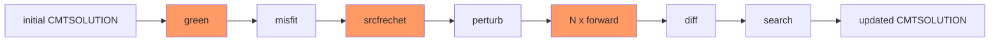
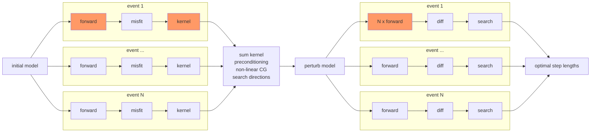

# DESCRIPTION

* this package is used for post-processing and managing inversion work flow
    with specfem3d_globe.

#====== Contents

1. include/, src/: Fortran codes for SEM data processing

2. utils/: scripts used to manage the inversion work flow 
    * sem_create.sh, sem_build.sh
    * setup_mesh.sh, setup_event.sh, setup_adjoint.sh, measure_misfit.py
    * update_model.sh, update_kernel.sh
    * make_vtk.sh, make_slice_gcircle.sh, make_slice_sphere.sh
    * plot_slice_*.sh, plot_misfit.sh


## Folder Structure for an inversion project


```shell
project/
    sem_utils/ # utility scripts and excutables to run the inversion
    |   
    sem_config/ # configuration files for SEM (model setup,)
    |   setup/ # these header files are used to build specfem3d_globe
    |   |   constants.h.in
    |   |   precision.h (optional)
    |   |   values_from_mesher.h (optional)
    |   DATA/
    |   |   Par_file #used to build specfem3d_globe
    |   starting_model/
    |   ...
    |
    specfem3d_globe/ # build directory of SEM excutables (xmesher3D, xspecfem3D)
    |   bin/
    |   ...
    |
    events/ # waveform data
    |   <event_id>/
    |   |   channel.txt # fdsnws-station: text output at channel level  
    |   |   CMTSOLUTION # SEM inputs
    |   |   STATIONS # SEM inputs
    |   |   data.h5
    |   ...
    |   
    stage??.[source|structure]/ # iteration database
    |   iter??/
    |   |   control_file.00 # a shell script contains control parameters
    |   |   |
    |   |   model/
    |   |   |   DATABASES_MPI/
    |   |   |   |   prco***_reg1_<model_name>_dmodel.bin # model updates
    |   |   |   |   prco***_reg1_<v??,rho,eta>.bin # updated model files
    |   |   |   |
    |   |   mesh/
    |   |   |   DATABASES_MPI/proc*_reg1_solver_data.bin
    |   |   |   DATA/ # necessary data files, Par_file 
    |   |   |   
    |   |   events/
    |   |   |   <event_id>/
    |   |   |   |   DATABASES_MPI/ 
    |   |   |   |   DATA/ 
    |   |   |   |   output_syn/ 
    |   |   |   |   |   sac/
    |   |   |   |   output_kernel/ 
    |   |   |   |   |   kernel/ proc*_reg1_cijkl,rho_kernel.bin
    |   |   |   |   output_hess/ 
    |   |   |   |   |   kernel/ proc*_reg1_cijkl,rho_kernel.bin
    |   |   |   |   output_perturb/ # simulation for perturbed model
    |   |   |   |   |   sac/
    |   |   |   |   misfit/ 
    |   |   |   |   |   CMTSOLUTION.reloc # relocated source parameter
    |   |   |   |   |   misfit.h5 # misfit measurments (e.g. CC0, CCmax, ...)
    |   |   |   |   SEM/ # adjoint source for kernel calculation 
    |   |   |   ...
    |   |   |
    |   |   kernel_sum/ # summed kernel (with precondition, smoothing, thresholding etc.)
    |   |   |           # *_dkernel.bin, *_kernel.bin
    |   |   |
    |   iter??/
    |   |   ...
```


#====== Project setup

1. setup sem_config/
   
    * DATA/Par_file: define model geometry, mesh slices, simulation properties, etc.

    * setup/constants.h.in: fine tuning of mesh parameters
        - regional_moho, moho_stretching, ...

    * starting_model/DATABASES_MPI: give intial model gll files 
        - NOTE: must has the same mesh geometry as would be created from the above configurations. 
        - proc*_reg1_[vpv,vph,vsv,vsh,eta,rho].bin

2. build specfem3d_globe

    * utils/sem_create.sh

    * utils/sem_build.sh

3. compile utility codes in this directory:

    * put the following SEM header files generated after building the specfem3d_globe:

        - specfem3d_globe/setup/{constants.h, precision.h} 
        - specfem3d_globe/OUTPUT_FILES/values_from_mesher.h,

    into include/. You should use these header files for your own application.

    * set correct path to netcdf include and lib directories in Makefile
    
    * make -f Makefile clean all

4. prepare the waveform data directory events/ as described in section:{Folder structure}


#====== Work flow for each iteration

1. setup control parameters for the current iteration.

    * copy and modify utils/control_file into project/iterations/contro_file.<iter>

2. run scripts utils/qsub_iteration to submit jobs for the whole iteration

    > mesh.job
    * utils/update_model.sh -> model/ # check model update direction, step_length
    * utils/setup_mesh.sh -> mesh/
    
    > <event_id>.job
    * utils/setup_event.sh, setup_adjoint -> <event_id>/  (for all events)
    
    > kernel.job
    * utils/update_kernel.sh -> kernel/

3. post-process:

    * plot x-sections: model, kernel

    * plot data misfit: station misfit distribution, waveform profile for each earthquake


## Work flow of source inversion (one earthquake)



```pseudocode
# Note: [***_job] is a slurm job

[green_job] forward simulation
[misfit_job] measure misfit
[srcfrechet_job] adjoint simulation, get source gradients (e.g. dchi_dxs, dchi_dmt)

[perturb_job] perturb source parameters along some chosen search directions (e.g. dxs, dmt)
[forward_perturb_job] forward simulation for perturbed models

[search_job]
    get waveform differences for each search direction in model space
    while changes in the optimal step lengths greater than a threshold:
      calculate misfit for a range of step lengths, assuming linear relationship between waveform differences and step length
    get optimal step lengths
```


## Work flow of structural inversion



```pseudocode
# Note: [***_job] is a slurm job

for each event:
     [forward_job] forward simulation
     [misfit_job]  measure misfit
     [kernel_job]  kernel simulation, get model gradients (e.g. cijkl_kernel)

[sum_kernel_job] sum model gradients for all events to get averaged model gradients, also with preconditioning

[perturb_model_job] perturb model parameters along some chosen search directions (e.g. dVp, dVs) based on averaged gradients and also nonliear-cg

for each event:
  [forward_perturb_job] forward simulation for perturbed models

[search_job]
  for each event:
    get waveform differences for each search direction in model space
  while changes in the optimal step lengths greater than a threshold:
    for each event:
      calculate misfit for a range of step lengths, assuming linear relationship between waveform differences and step length
    sum search results for all event, get optimal step lengths
```


**Starting model**: S362ani + Crust1.0, smoothing through Moho, 410-/660-km discontinuities (no discon. in the starting model)

**Anisotropy**: radial anisotropy above 220-km, isotropy below 220 km; maybe TTI later…

**Preconditioning** (Filtering):  Hessian approximation, point-spread or random Hessian-vector test: estimate local illumination strength (Hessian diagonal) or local convolution kernel; maybe as an deep-learning image to image transformer?


spatial variant (non-stationary), direction-dependent (anisotropic) smoothing via solving the diffusion equation: 
$$
\partial_{t}{m} - \nabla \cdot(\mathbf{K}\cdot\nabla) m = 0, x\in V \subset \R^d, t \in [0, 1] \\
 m(x,t=0) = g(x)
$$
. $ m(x,t=1)$ is taken as the smoothed model of $g(x)$. For homogeneous and isotropic $\mathbf{K} = k\mathbf{I}$ the solution in infinite space is equivalent to convolving a Gaussian kernel $(4{\pi}kt)^{d/2}\exp(-\frac{r^2}{4kt})$ with the initial value $g(x)$.

Weak form ($\psi$: test function)
$$
\int_{V}\partial_{t}u(\mathbf{x},t) \psi(\mathbf x)d^3x + \int_{V}\nabla{u}(\mathbf x, t)\cdot \mathbf{K} \cdot \nabla{\psi}(\mathbf x)d^3x = 0
$$
Discretization

- subdividing $V$ into disjoint elements $V_e$: 
  - $V = \bigcup_{e=1}^{N_e} V_e$
- mapping reference cube $[-1,1]^3$ to $V_e$: 
  - $\mathbf{F}_e: \boldsymbol \xi \mapsto \mathbf{x}$
- local basis function in the reference cube: 
  - $\psi^e_{ijk}(\xi,\eta,\gamma) = \ell_{i}^{N}(\xi) \ell_{j}^{N}(\eta) \ell_{k}^{N}(\gamma)$ 
  - N-th order Lagrange polynomials with **GLL** nodes: $(\xi^{gll}_i,\eta^{gll}_j,\gamma^{gll}_k)$
  - **GLL** quadrature: $\int_{V_e} f(\boldsymbol \xi)dV \approx \sum_{ijk}w_{ijk}f(\boldsymbol\xi^{gll}_{ijk})$
- local to global mapping:
  - $g = G(e,ijk)$  
  - collocated nodes shared by two elements are assigned to unique indices
- test/trial function space $\{\psi_g\}$: 
  - $\psi_g = \sum_{G(e,ijk)=g} \psi_{ijk}^{e}$
  - continuous across elements
  - $u(\mathbf x, t) \approx \sum_{g}{u_g(t) \psi_g(\boldsymbol \xi(\mathbf x))}$

Weak solution after discretization:
$$
\int_{V}\sum_{g'}{\dot{u}_{g'}(t) \psi_{g'}(\boldsymbol \xi(\mathbf x))} \psi_g(\boldsymbol \xi(\mathbf x))dV + \int_{V}\sum_{g'}{{u}_{g'}(t) \nabla_{\mathbf x}\psi_{g'}(\boldsymbol \xi(\mathbf x))} \cdot \mathbf{K} \cdot \nabla{\psi_g}(\boldsymbol\xi(\mathbf x)dV = 0
$$
for any $\psi_g$.
$$
\int_{V}\sum_{g'}{\dot{u}_{g'}(t) \psi_{g'}(\boldsymbol \xi(\mathbf x))} \sum_{G(e,ijk)=g} \psi_{ijk}^{e}(\boldsymbol \xi(\mathbf x)) dV + \int_{V}\sum_{g'}{{u}_{g'}(t) \nabla_{\mathbf x}\psi_{g'}(\boldsymbol \xi(\mathbf x))} \cdot \mathbf{K} \cdot \nabla{\psi_g}(\boldsymbol\xi(\mathbf x)dV = 0
$$


Contribution from each element:
$$
\int_{V_e}{u}(\xi,\eta,\gamma,t)\psi_{qrs}(\xi,\eta,\gamma)d{\xi}d{\eta}d{\gamma} + \int_{\Omega_e}\sum_{ijk}{{u}^e_{ijk}(t)\nabla{\psi}_{ijk}(\mathbf x)}\cdot \mathbf{K} \cdot \nabla{\psi}_{qrs}(\mathbf x)d^3x = 0
$$

$$
\int_{\Omega_e}\sum_{ijk}{\ddot{u}^e_{ijk}(t)\psi_{ijk}(\mathbf x)}\psi_{qrs}(\mathbf x)d^3x + \int_{\Omega_e}\sum_{ijk}{{u}^e_{ijk}(t)\nabla{\psi}_{ijk}(\mathbf x)}\cdot \mathbf{K} \cdot \nabla{\psi}_{qrs}(\mathbf x)d^3x = 0
$$
