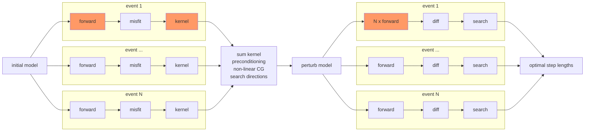

# DESCRIPTION

* this package is used for post-processing and managing inversion work flow
    with specfem3d_globe.

#====== Contents

1. include/, src/: Fortran codes for SEM data processing

2. utils/: scripts used to manage the inversion work flow 
    * sem_create.sh, sem_build.sh
    * setup_mesh.sh, setup_event.sh, setup_adjoint.sh, measure_misfit.py
    * update_model.sh, update_kernel.sh
    * make_vtk.sh, make_slice_gcircle.sh, make_slice_sphere.sh
    * plot_slice_*.sh, plot_misfit.sh


## Folder Structure for an inversion project


```shell
project/
    sem_utils/ # utility scripts and excutables to run the inversion
    |   
    sem_config/ # configuration files for SEM (model setup,)
    |   setup/ # these header files are used to build specfem3d_globe
    |   |   constants.h.in
    |   |   precision.h (optional)
    |   |   values_from_mesher.h (optional)
    |   DATA/
    |   |   Par_file #used to build specfem3d_globe
    |   starting_model/
    |   ...
    |
    specfem3d_globe/ # build directory of SEM excutables (xmesher3D, xspecfem3D)
    |   bin/
    |   ...
    |
    events/ # waveform data
    |   <event_id>/
    |   |   channel.txt # fdsnws-station: text output at channel level  
    |   |   CMTSOLUTION # SEM inputs
    |   |   STATIONS # SEM inputs
    |   |   data.h5
    |   ...
    |   
    stage??.[source|structure]/ # iteration database
    |   iter??/
    |   |   control_file.00 # a shell script contains control parameters
    |   |   |
    |   |   model/
    |   |   |   DATABASES_MPI/
    |   |   |   |   prco***_reg1_<model_name>_dmodel.bin # model updates
    |   |   |   |   prco***_reg1_<v??,rho,eta>.bin # updated model files
    |   |   |   |
    |   |   mesh/
    |   |   |   DATABASES_MPI/proc*_reg1_solver_data.bin
    |   |   |   DATA/ # necessary data files, Par_file 
    |   |   |   
    |   |   events/
    |   |   |   <event_id>/
    |   |   |   |   DATABASES_MPI/ 
    |   |   |   |   DATA/ 
    |   |   |   |   output_syn/ 
    |   |   |   |   |   sac/
    |   |   |   |   output_kernel/ 
    |   |   |   |   |   kernel/ proc*_reg1_cijkl,rho_kernel.bin
    |   |   |   |   output_hess/ 
    |   |   |   |   |   kernel/ proc*_reg1_cijkl,rho_kernel.bin
    |   |   |   |   output_perturb/ # simulation for perturbed model
    |   |   |   |   |   sac/
    |   |   |   |   misfit/ 
    |   |   |   |   |   CMTSOLUTION.reloc # relocated source parameter
    |   |   |   |   |   misfit.h5 # misfit measurments (e.g. CC0, CCmax, ...)
    |   |   |   |   SEM/ # adjoint source for kernel calculation 
    |   |   |   ...
    |   |   |
    |   |   kernel_sum/ # summed kernel (with precondition, smoothing, thresholding etc.)
    |   |   |           # *_dkernel.bin, *_kernel.bin
    |   |   |
    |   iter??/
    |   |   ...
```


#====== Project setup

1. setup sem_config/
   
    * DATA/Par_file: define model geometry, mesh slices, simulation properties, etc.

    * setup/constants.h.in: fine tuning of mesh parameters
        - regional_moho, moho_stretching, ...

    * starting_model/DATABASES_MPI: give intial model gll files 
        - NOTE: must has the same mesh geometry as would be created from the above configurations. 
        - proc*_reg1_[vpv,vph,vsv,vsh,eta,rho].bin

2. build specfem3d_globe

    * utils/sem_create.sh

    * utils/sem_build.sh

3. compile utility codes in this directory:

    * put the following SEM header files generated after building the specfem3d_globe:

        - specfem3d_globe/setup/{constants.h, precision.h} 
        - specfem3d_globe/OUTPUT_FILES/values_from_mesher.h,

    into include/. You should use these header files for your own application.

    * set correct path to netcdf include and lib directories in Makefile
    
    * make -f Makefile clean all

4. prepare the waveform data directory events/ as described in section:{Folder structure}


#====== Work flow for each iteration

1. setup control parameters for the current iteration.

    * copy and modify utils/control_file into project/iterations/contro_file.<iter>

2. run scripts utils/qsub_iteration to submit jobs for the whole iteration

    > mesh.job
    * utils/update_model.sh -> model/ # check model update direction, step_length
    * utils/setup_mesh.sh -> mesh/
    
    > <event_id>.job
    * utils/setup_event.sh, setup_adjoint -> <event_id>/  (for all events)
    
    > kernel.job
    * utils/update_kernel.sh -> kernel/

3. post-process:

    * plot x-sections: model, kernel

    * plot data misfit: station misfit distribution, waveform profile for each earthquake


## Work flow of source inversion (one earthquake)


```pseudocode
# Note: [***_job] is a slurm job

[green_job] forward simulation
[misfit_job] measure misfit, get adjoint source (dchi_du)
[srcfrechet_job] adjoint simulation, get source gradients (e.g. dchi_dxs, dchi_dmt)

[perturb_job] perturb source parameters along some chosen search directions (e.g. dxs, dmt)
[forward_perturb_job] forward simulation for perturbed models

[search_job]
    get waveform differences for each search direction in model space
    while changes in the optimal step lengths greater than a threshold:
      calculate misfit for a range of step lengths, assuming linear relationship between waveform differences and step length
    get optimal step lengths
```


## Work flow of structural inversion



```pseudocode
# Note: [***_job] is a slurm job

for each event:
     [forward_job] forward simulation
     [misfit_job]  measure misfit
     [kernel_job]  kernel simulation, get model gradients (e.g. cijkl_kernel)

[sum_kernel_job] sum model gradients for all events to get averaged model gradients, also with preconditioning

[perturb_model_job] perturb model parameters along some chosen search directions (e.g. dVp, dVs) based on averaged gradients and also nonliear-cg

for each event:
  [forward_perturb_job] forward simulation for perturbed models

[search_job]
  for each event:
    get waveform differences for each search direction in model space
  while changes in the optimal step lengths greater than a threshold:
    for each event:
      calculate misfit for a range of step lengths, assuming linear relationship between waveform differences and step length
    sum search results for all event, get optimal step lengths
```


**Starting model**: S362ani + Crust1.0, smoothing through Moho, 410-/660-km discontinuities (no discon. in the starting model)

**Anisotropy**: radial anisotropy above 220-km, isotropy below 220 km; maybe TTI later…

**Preconditioning** (Filtering):  Hessian approximation, point-spread or random Hessian-vector test: estimate local illumination strength (Hessian diagonal) or local convolution kernel; maybe as an deep-learning image to image transformer?


## Heat equation in SEM

Spatial variant (non-stationary), direction-dependent (anisotropic) smoothing via solving the diffusion equation: 
$$
\partial_{t}{u} - \nabla \cdot(\mathbf{K}\cdot\nabla) u = 0, x\in V \subset \R^3, t \in [0, 1] \\
\text{(I.C.) } u(x,t=0) = g(x) \cr
\text{(B.C.) } {\bf{n}}\cdot (\mathbf{K}\cdot\nabla u) = 0, x \in \partial V\cr
$$
. $u(x,t=1)$ is taken as the smoothed model of $g(x)$. For homogeneous and isotropic $\mathbf{K} = k\mathbf{I}$ the solution in infinite space is equivalent to convolving a Gaussian kernel $(4{\pi}kt)^{-3/2}\exp(-\frac{r^2}{4kt})$ with the initial value $g(x)$.

### Weak form

$$
\int_V {{\partial _t}u\left( {{\bf{x}},t} \right)\phi \left( {\bf{x}} \right)dV}  + \int_V {\nabla u\left( {{\bf{x}},t} \right) \cdot {\bf{K}} \cdot \nabla \phi \left( {\bf{x}} \right)dV}  = 0
$$
$\phi$ is the test function.

### **Discretization**

- subdividing $V$ into disjoint elements $V_e$: 
  - $V = \bigcup_{e=1}^{N_e} V_e$
- mapping between $V_e$ and the reference cube $[-1,1]^3$ : 
  - $\mathbf{F}_e: [-1,1]^3 \to V_e$
  - ${{\bf{x}}^e}\left( {\bf{\xi }} \right) =  {{\bf{F}^e}} \left( \bf \xi \right)$
  - $${{\bf{\xi }}^e}\left( {\bf{x}} \right) = {\left( {{{\bf{F}}^e}} \right)^{ - 1}}\left( {\bf{x}} \right)$$
- Gauss-Legendre-Labotto interpolation/quadrature:
  - basis function: $$\ell _\alpha ^{GLL}\left( \xi  \right) = {\left( {\prod\limits_{\beta  \ne \alpha }^N {\left( {\xi _\alpha ^{GLL} - \xi _\beta ^{GLL}} \right)} } \right)^{ - 1}}\prod\limits_{\beta  \ne \alpha }^N {\left( {\xi  - \xi _\beta ^{GLL}} \right)} $$
  - Lagrange polynomial of N **GLL** nodes: $\xi^{GLL}_\alpha, ~ \alpha=1,\ldots,N$
  - **GLL** quadrature: $\int\limits_{ - 1}^1 {f\left( \xi  \right)d\xi }  \approx \sum\limits_\alpha {{w_\alpha}f\left( {\xi _{\alpha}^{GLL}} \right)} $
- local basis function: 
  - $$\psi _\alpha ^e\left( {\bf{x}} \right) = {L_\alpha }\left( {{{\bf{\xi }}^e}\left( {\bf{x}} \right)} \right){I_{{V_e}}}\left( {\bf{x}} \right)$$  ($N^3$ basis functions in each element)
  - ${L_{\bf{\alpha }}}\left( {\bf{\xi }} \right) = \prod\limits_{i = 1}^3 {\ell _{{\alpha _i}}^{GLL}\left( {{\xi _i}} \right)} ,{\alpha _i} = 1, \ldots ,{N_{GLL}}$  note: $\alpha = (\alpha_1, \alpha_2, \alpha_3)$
  - $$\frac{{\partial {L_\alpha }}}{{\partial {\xi _i}}}\left( {{\bf{\xi }}_\beta ^{GLL}} \right) = \dot \ell _{{\alpha _i}}^{GLL}\left( {\xi _{{\beta _i}}^{GLL}} \right)\prod\limits_{j \ne i} {\ell _{{\alpha _j}}^{GLL}\left( {\xi _{{\beta _j}}^{GLL}} \right)}  = \dot \ell _{{\alpha _i}}^{GLL}\left( {\xi _{{\beta _i}}^{GLL}} \right)\prod\limits_{j \ne i} {{\delta _{{\alpha _j}{\beta _j}}}} $$
- local to global mapping:
  - $g = G(e,\alpha)$  
  - nodes shared by more than one elements (e.g. on element faces/corners) are assigned to unique indices
- test/trial basis function $\{\psi_g\}$: 
  - $\psi_g = \sum_{G(e,\alpha)=g} \psi_{\alpha}^{e}$
  - any test or trial function is continuous across elements
  - $u(\mathbf x, t) \approx \sum_{g}{u_g(t) \psi_g(\boldsymbol \xi(\mathbf x))}$

### Weak solution after discretization

$$
\begin{equation} 

\label{weak}
\int_{V}\sum_{g'}{\dot{u}_{g'}(t) \psi_{g'}(\boldsymbol \xi(\mathbf x))} \psi_g(\boldsymbol \xi(\mathbf x))dV + \int_{V}\sum_{g'}{{u}_{g'}(t) \nabla_{\mathbf x}\psi_{g'}(\boldsymbol \xi(\mathbf x))} \cdot \mathbf{K} \cdot \nabla{\psi_g}(\boldsymbol\xi(\mathbf x)dV = 0

\end{equation}
$$
for any test function $\psi_g$.

After substituting GLL basis function in the first term on the left hand side of $\eqref{weak}$:
$$
\begin{align} 

\int_V {\left( {\sum\limits_{g'} {{{\dot u}_{g'}}{\psi _{g'}}} } \right){\psi _g}dV}  
& = \int_V {\left( {\sum\limits_{g'} {\sum\limits_{G(e',\alpha') = g'} {\dot u_{\alpha'}^{e'}\psi _{\alpha'}^{e'}} } } \right)\sum\limits_{G(e,\alpha) = g} {\psi _{\alpha}^e} dV}  \cr

\label{weak1}
& = \sum\limits_{G(e,\alpha) = g} {\sum\limits_{g'} {\sum\limits_{G(e',\alpha') = g'} {\dot u_{\alpha'}^{e'}\int_V {\psi _{\alpha'}^{e'}\psi _{\alpha}^edV} } } } 

\end{align}
$$
Apply the GLL quadrature to the integral in $\eqref{weak1}$: 
$$
\begin{align}

 \int_V {\psi _{\alpha'}^{e'}\psi _{\alpha}^edV}  & = {\delta _{ee'}}\int_{{V_e}} {\psi _{\alpha'}^e\psi _{\alpha}^edV } \cr
 
 & = {\delta _{ee'}}\int_{{{\left[ { - 1,1} \right]}^3}} {{L_{\alpha'}}{L_{\alpha}}\det \left( {{{\bf{J}}^e}} \right){d^3}\xi }   \cr 
 
 &  \approx {\delta _{ee'}}\sum\limits_{\beta} {{w_{\beta}}{L_{\alpha'}}\left( {{\bf{\xi }}_{\beta}^{GLL}} \right){L_{\alpha}}\left( {{\bf{\xi }}_{\beta}^{GLL}} \right)\det {{\bf{J}}^e}\left( {{\bf{\xi }}_{\beta}^{GLL}} \right)}  \cr
 
 \label{int1}
 & = {\delta _{ee'}}{\delta _{\alpha\alpha'}}{w_{\alpha}}\det {{\bf{J}}^e}\left( {{\bf{\xi }}_{\alpha}^{GLL}} \right) 
 
\end{align}
$$
Substituting $\eqref{int1}$ into $\eqref{weak1}$ we have
$$
\begin{align} 

\int_V {\left( {\sum\limits_{g'} {{{\dot u}_{g'}}{\psi _{g'}}} } \right){\psi _g}dV}  
& = \sum\limits_{G(e,\alpha) = g} {\sum\limits_{g'} {\sum\limits_{G(e',\alpha') = g'} {\dot u_{\alpha'}^{e'}{\delta _{ee'}}{\delta _{\alpha\alpha'}}{w_{\alpha}}\det {{\bf{J}}^e}\left( {{\bf{\xi }}_{\alpha}^{GLL}} \right)} } }  \cr
& = \sum\limits_{G(e,\alpha) = g} {\dot u_{\alpha}^e{w_{\alpha}}\det {{\bf{J}}^e}\left( {{\bf{\xi }}_{\alpha}^{GLL}} \right)}

\end{align}
$$


The second term on the left hand side of $\eqref{weak}$: 
$$
\begin{align}

\label{stiff}
\int_V {\left( {\sum\limits_{g'} {{u_{g'}}\nabla {\psi _{g'}}} } \right) \cdot {\bf{K}} \cdot \nabla {\psi _g}dV}  = \sum\limits_{G(e,\alpha) = g} {\sum\limits_{g'} {\sum\limits_{G(e',\alpha') = g'} {u_{\alpha'}^{e'}\int_V {\nabla \psi _{\alpha'}^{e'} \cdot {\bf{K}} \cdot \nabla \psi _{\alpha}^edV} } } } 

\end{align}
$$
The integral on the right hand side of $\eqref{stiff}$ is
$$
\begin{align}

\int_V {\nabla \psi _{\alpha '}^{e'} \cdot {\bf{K}} \cdot \nabla \psi _\alpha ^edV}  
& = {\delta _{ee'}}\int_{{V_e}} {\nabla \psi _{\alpha '}^e \cdot {\bf{K}} \cdot \nabla \psi _\alpha ^edV}   \cr

& = {\delta _{ee'}}\int_{{{\left[ { - 1,1} \right]}^3}} {\sum\limits_{i,j} {{K_{ij}}\left( {\sum\limits_n {\frac{{\partial {L_{\alpha '}}}}{{\partial {\xi _n}}}\frac{{\partial \xi _n^e}}{{\partial {x_i}}}} } \right)\left( {\sum\limits_m {\frac{{\partial {L_\alpha }}}{{\partial {\xi _m}}}\frac{{\partial \xi _m^e}}{{\partial {x_j}}}} } \right)} \det {{\bf{J}}^e}{d^3}\xi } 

\end{align}
$$

So $\eqref{stiff}$ can be simplified as 
$$
\begin{align}

& \int_V {\left( {\sum\limits_{g'} {{u_{g'}}\nabla {\psi _{g'}}} } \right) \cdot {\bf{K}} \cdot \nabla {\psi _g}dV}  \nonumber \cr 

& = \sum\limits_{G(e,\alpha ) = g} {\int_{{{\left[ { - 1,1} \right]}^3}} {\sum\limits_{i,j} {{K_{ij}}\left( {\sum\limits_n {\sum\limits_{\alpha '} {u_{\alpha '}^e} \frac{{\partial {L_{\alpha '}}}}{{\partial {\xi _n}}}\frac{{\partial \xi _n^e}}{{\partial {x_i}}}} } \right)\left( {\sum\limits_m {\frac{{\partial {L_\alpha }}}{{\partial {\xi _m}}}\frac{{\partial \xi _m^e}}{{\partial {x_j }}}} } \right)} \det {{\bf{J}}^e}{d^3}\xi } }   \cr 
  
 \label{stiff2}
 &  \approx \sum\limits_{G(e,\alpha ) = g} {\sum\limits_\beta  {{w_\beta }\sum\limits_{i,j} {\left[ {{K_{ij}}\left( {\sum\limits_n {\sum\limits_{\alpha '} {u_{\alpha '}^e} \frac{{\partial {L_{\alpha '}}}}{{\partial {\xi _n}}}\frac{{\partial \xi _n^e}}{{\partial {x_i}}}} } \right)\left( {\sum\limits_m {\frac{{\partial {L_\alpha }}}{{\partial {\xi _m}}}\frac{{\partial \xi _m^e}}{{\partial {x_j }}}} } \right)\det {{\bf{J}}^e}} \right]\left( {{\bf{\xi }}_\beta ^{GLL}} \right)} } }  
  

\end{align}
$$

> [!NOTE]
>
> For isotropic smoothing kernel ${K_{ij}}\left( \bf {x} \right) = {K^{ISO}}\left( \bf{x} \right){\delta _{ij}}$  $\eqref{stiff2}$ can be simplified as: 
> $$
> \begin{equation}
> 
> \sum\limits_{G(e,\alpha ) = g} {\sum\limits_m {\sum\limits_\beta  {{w_\beta }{K^{ISO}}\left( {{\bf{\xi }}_\beta ^{GLL}} \right)\frac{{\partial {L_\alpha }}}{{\partial {\xi _m}}}\left( {{\bf{\xi }}_\beta ^{GLL}} \right)\sum\limits_i {\left( {\sum\limits_n {\sum\limits_{\alpha '} {u_{\alpha '}^e} \frac{{\partial {L_{\alpha '}}}}{{\partial {\xi _n}}}\frac{{\partial \xi _n^e}}{{\partial {x_i}}}} } \right)\left( {{\bf{\xi }}_\beta ^{GLL}} \right)\frac{{\partial \xi _m^e}}{{\partial {x_i}}}\left( {{\bf{\xi }}_\beta ^{GLL}} \right)\det {{\bf{J}}^e}\left( {{\bf{\xi }}_\beta ^{GLL}} \right)} } } } 
> 
> \end{equation}
> $$
> With further simplication
> $$
> \begin{align}
> \left( {\sum\limits_n {\sum\limits_{\alpha '} {u_{\alpha '}^e} \frac{{\partial {L_{\alpha '}}}}{{\partial {\xi _n}}}\frac{{\partial \xi _n^e}}{{\partial {x_i}}}} } \right)\left( {{\bf{\xi }}_\beta ^{GLL}} \right) 
> &  = \sum\limits_n {\frac{{\partial \xi _n^e}}{{\partial {x_i}}}\left( {{\bf{\xi }}_\beta ^{GLL}} \right)\sum\limits_{\alpha '} {u_{\alpha '}^e} \frac{{\partial {L_{\alpha '}}}}{{\partial {\xi _n}}}\left( {{\bf{\xi }}_\beta ^{GLL}} \right)}   \cr 
> &  = \sum\limits_n {\frac{{\partial \xi _n^e}}{{\partial {x_i}}}\left( {{\bf{\xi }}_\beta ^{GLL}} \right)\sum\limits_{\alpha '} {u_{\alpha '}^e\left[ {\dot \ell _{{{\alpha '}_n}}^{GLL}\left( {\xi _{{\beta _n}}^{GLL}} \right)\prod\limits_{j \ne n} {{\delta _{{\alpha _j}{\beta _j}}}} } \right]} }   \cr 
> &  = \sum\limits_n {\frac{{\partial \xi _n^e}}{{\partial {x_i}}}\left( {{\bf{\xi }}_\beta ^{GLL}} \right)\sum\limits_{{{\alpha '}_n}} {u_{{{\alpha '}_n},{\beta _{ \cdot  \ne n}}}^e\dot \ell _{{{\alpha '}_n}}^{GLL}\left( {\xi _{{\beta _n}}^{GLL}} \right)} }   \cr 
> 
> \end{align}
> $$
>
> and for less visual clutter we define
> $$
> {\Psi _{m,\beta }} \triangleq {K^{ISO}}\left( {{\bf{\xi }}_\beta ^{GLL}} \right)\sum\limits_i {\left( {\sum\limits_n {\sum\limits_{\alpha '} {u_{\alpha '}^e} \frac{{\partial {L_{\alpha '}}}}{{\partial {\xi _n}}}\frac{{\partial \xi _n^e}}{{\partial {x_i}}}} } \right)\left( {{\bf{\xi }}_\beta ^{GLL}} \right)\frac{{\partial \xi _m^e}}{{\partial {x_i}}}\left( {{\bf{\xi }}_\beta ^{GLL}} \right)\det {{\bf{J}}^e}\left( {{\bf{\xi }}_\beta ^{GLL}} \right)}
> $$
> We can finally calculate $\eqref{stiff2}$ as
> $$
> \begin{align}
> 
> \int_V {\left( {\sum\limits_{g'} {{u_{g'}}\nabla {\psi _{g'}}} } \right) \cdot {\bf{K}} \cdot \nabla {\psi _g}dV} & \approx \sum\limits_{G(e,\alpha ) = g} {\sum\limits_m {\sum\limits_\beta  {{w_\beta }\frac{{\partial {L_\alpha }}}{{\partial {\xi _m}}}\left( {{\bf{\xi }}_\beta ^{GLL}} \right){\Psi _{m,\beta }}} } }   \cr 
> &  = \sum\limits_{G(e,\alpha ) = g} {\sum\limits_m {\sum\limits_\beta  {{w_\beta }\left[ {\dot \ell _{{\alpha _m}}^{GLL}\left( {\xi _{{\beta _m}}^{GLL}} \right)\prod\limits_{j \ne m} {{\delta _{{\alpha _j}{\beta _j}}}} } \right]{\Psi _{m,\beta }}} } }   \cr 
> &  = \sum\limits_{G(e,\alpha ) = g} {\sum\limits_m {\sum\limits_{{\beta _m}} {{w_{{\beta _m},{\alpha _{ \cdot  \ne m}}}}\dot \ell _{{\alpha _m}}^{GLL}\left( {\xi _{{\beta _m}}^{GLL}} \right){\Psi _{m,\left( {{\beta _m},{\alpha _{ \cdot  \ne m}}} \right)}}} } }  \cr
> 
> \end{align}
> $$
>
> The final weak solution for heat equation can be written as
> $$
> \sum\limits_{G(e,\alpha ) = g} {\dot u_\alpha ^e{w_\alpha }\det {{\bf{J}}^e}\left( {{\bf{\xi }}_\alpha ^{GLL}} \right)}  =- \sum\limits_{G(e,\alpha ) = g} {\sum\limits_m {\sum\limits_{{\beta _m}} {{w_{{\beta _m},{\alpha _{ \cdot  \ne m}}}}\dot \ell _{{\alpha _m}}^{GLL}\left( {\xi _{{\beta _m}}^{GLL}} \right){\Psi _{m,\left( {{\beta _m},{\alpha _{ \cdot  \ne m}}} \right)}}} } }
> $$
> for every basis function $\psi_g$ of the test function space. 


## Parameterization for radial anisotropy 

In Voigt notation the radial anisotropy with symmetric axis along the 3rd axis can be written in Love parameters
$$
{C_{IJ}} = \left( {\begin{array}{*{20}{c}}
A&{A - 2N}&F&0&0&0\\
{}&A&F&0&0&0\\
{}&{}&C&0&0&0\\
{}&{}&{}&L&0&0\\
{}&{}&{}&{}&L&0\\
{}&{}&{}&{}&{}&N
\end{array}} \right)
$$
The relation between the Love parameters (A,C,L,N,F) and  $V_{PH},V_{PV},V_{SH},V_{SV},\eta$
$$
\begin{array}{l}
A = \rho V_{PH}^2\\
C = \rho V_{PV}^2\\
L = \rho V_{SV}^2\\
N = \rho V_{SH}^2\\
F = \eta \left( {A - 2L} \right) = \rho \eta \left( {V_{PH}^2 - 2V_{SV}^2} \right)
\end{array}
$$
Re-parameterization $a_{IJ} = \rho^{-1} C_{IJ}$
$$
{a_{IJ}} = \frac{{{C_{IJ}}}}{\rho } = \left( {\begin{array}{*{20}{c}}
{V_{PH}^2}&{V_{PH}^2 - 2V_{SH}^2}&{\eta \left( {V_{PH}^2 - 2V_{SV}^2} \right)}&0&0&0\\
{}&{V_{PH}^2}&{\eta \left( {V_{PH}^2 - 2V_{SV}^2} \right)}&0&0&0\\
{}&{}&{V_{PV}^2}&0&0&0\\
{}&{}&{}&{V_{SV}^2}&0&0\\
{}&{}&{}&{}&{V_{SV}^2}&0\\
{}&{}&{}&{}&{}&{V_{SH}^2}
\end{array}} \right)
$$
Conversion of kernels $K_{C_{IJ}},K_{\rho} \to K_{a_{IJ}},K_{\rho\prime}$ :
$$
\begin{array}{l}
{K_{{a_{IJ}}}} = \rho {K_{{C_{IJ}}}}\\
{K_{\rho '}} = {K_\rho } + \sum {{a_{IJ}}{K_{{C_{IJ}}}}} 
\end{array}
$$
Re-parameterization velocities as $\alpha,\beta,\xi,\phi,\eta$ 
$$
\begin{array}{l}
{V_P} = \left( {1 + \alpha } \right){V_{P0}}\\
{V_S} = \left( {1 + \beta } \right){V_{S0}}\\
V_P^2 = \frac{{V_{PV}^2 + 4V_{PH}^2}}{5}\\
V_S^2 = \frac{{2V_{SV}^2 + V_{SH}^2}}{3}\\
\xi  = \frac{{V_{SH}^2 - V_{SV}^2}}{{V_S^2}}\\
\phi  = \frac{{V_{PH}^2 - V_{PV}^2}}{{V_P^2}}
\end{array}
$$
So the velocities can be written as
$$
\begin{array}{l}
V_{PH}^2 = \left( {1 + \frac{1}{5}\phi } \right){\left( {1 + \alpha } \right)^2}V_{P0}^2\\
V_{PV}^2 = \left( {1 - \frac{4}{5}\phi } \right){\left( {1 + \alpha } \right)^2}V_{P0}^2\\
V_{SH}^2 = \left( {1 + \frac{2}{3}\xi } \right){\left( {1 + \beta } \right)^2}V_{S0}^2\\
V_{SV}^2 = \left( {1 - \frac{1}{3}\xi } \right){\left( {1 + \beta } \right)^2}V_{S0}^2
\end{array}
$$
